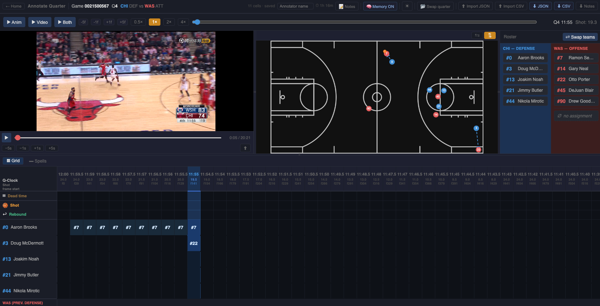

# NBA Guard Annotation

A desktop tool for annotating **defensive assignments** in NBA games — who is guarding whom, half-second by half-second — on top of SportVU player-tracking data.

Built for research use: annotations are keyed back to the source tracking frames, and two annotators' work can be compared to produce an inter-rater reliability figure.

<!-- SCREENSHOT: main annotation view (court + roster + grid) -->
<p align="center">
  
</p>

---

## Install

Download the latest installer from the [Releases](../../releases) page.

| Platform | File |
|---|---|
| Windows | `guardingwhoop-Setup-<version>.exe` (installer) or `-Portable-` (no install) |
| macOS | `guardingwhoop-<version>-arm64.dmg` |

Neither build is code-signed yet, so on first launch:
- **Windows** — SmartScreen warning → *More info* → *Run anyway*
- **macOS** — Gatekeeper warning → right-click the app → *Open*

---

## What it does

### Annotate a quarter

Load a full-quarter SportVU tracking JSON and assign every on-court defender to the attacker they are guarding.

- **Animated court** showing all 10 players and the ball, with flip controls (⇆ ⇅) to orient it
- **0.5-second buckets** — one annotation covers half a second of play
- **Video sync** — play a game video alongside the tracking animation
- **Memory (carry-forward)** — each new bucket auto-fills the previous assignment, so you only mark what *changes*
- **Dead-ball, shot and rebound flags** per bucket
- **Confidence rating** (1–3) per assignment
- **Free-text notes** tied to a moment
- **Undo / redo** for every edit
- Autosaves continuously; close and reopen without losing work

<!-- SCREENSHOT: annotation grid with a few assignments -->

### Two views of the same work

| View | Shows |
|---|---|
| **▦ Grid** | One column per 0.5s bucket — how the work is entered |
| **▬ Spells** | Consecutive buckets on the same attacker merged into one bar — *"#23 marked #7 for 6.5s, then switched"* |

The Spells view marks why each spell ended (⇄ switch · ■ dead ball · ⇆ defence swap · · gap), shows the weakest confidence in the stretch, and jumps the playhead when you click a bar.

<!-- SCREENSHOT: spells view -->

### Compare two annotators

Drop in two exported files for the same quarter and get a reliability report plus a per-disagreement review.

- Accepts **JSON or CSV**, and the two sides may be in different formats
- **Raw agreement**, **Cohen's κ** (published with its marginals), **switch-event F1** (±1s tolerance), and dead-ball agreement
- Every excluded cell is counted and shown: coverage mismatch, dead-ball, defending-team mismatch
- **Diff view** — consecutive buckets with the same verdict collapse into one bar; `n` / `p` step between disagreements; click one to jump the playhead and watch the play
- **Export a disagreement CSV** to work through away from the tool

<!-- SCREENSHOT: compare view with metric cards + diff bars -->

> **Read the caveats panel before quoting a number.** Carry-forward auto-fills most buckets, so adjacent cells are highly autocorrelated and the cell-level figures are inflated. The switch-event F1 is the metric that characterises annotation quality.

---

## How to use

### Annotating

1. Launch and click **Annotate Quarter**
2. Load `player_data.csv` (not mandatory, u can also skip this step), then drop in the quarter tracking JSON,
3. Optionally load a game video for reference
4. Navigate with the playback bar, the timeline header, or the keyboard
5. **Assign** by dragging an attacker from the roster onto a defender's cell — or drop onto `∅` for "guarding no one". You can also click a defender then an attacker on the court.
6. Toggle the defending team as possessions change; past assignments for both teams are kept
7. Mark dead-ball stretches with the **Dead** row so they are excluded from analysis
8. Export with **⬇ JSON** / **⬇ CSV** when done

Use **⬆ Import JSON** / **⬆ Import CSV** to resume from a previous export.

### Comparing

1. From the home screen, click **Compare Annotators**
2. Drop each annotator's exported file into the A and B panels
3. Read the metric cards, then step through disagreements with `n` / `p`
4. **⬇ Export disagreement CSV** for discussion

Files from different games or quarters are refused rather than compared — those numbers would look fine and mean nothing.

---

## Keyboard

| Key | Action |
|---|---|
| `Space` | Play / pause the tracking animation |
| `←` `→` | Step one annotation column (one 0.5s bucket) |
| `1` `2` `3` | Set confidence on the focused cell |
| `Esc` | Clear the focused cell / court selection |
| `Ctrl`/`Cmd` + `Z` | Undo |
| `Ctrl`/`Cmd` + `Shift` + `Z` | Redo |
| `n` / `p` | Next / previous disagreement *(compare view)* |

For frame-exact positioning, use the **`-5f` `-1f` `+1f` `+5f`** buttons in the playback bar.

---

## Export formats

**JSON** (`guard-annotation/v2`) — one entry per 0.5s bucket with frame and moment ranges, plus a metadata block holding the game, quarter, rosters and annotator. This is the format to keep.

**CSV** — one row per frame per on-court defender, for direct joining with the raw tracking data:

| Field | Description |
|---|---|
| `game_id`, `quarter` | Game identifiers |
| `frame`, `moment_id` | Frame index and SportVU moment timestamp |
| `gamestatus` | `active` or `dead` |
| `defending_team`, `attacking_team` | Team abbreviations |
| `defender_*`, `attacker_*` | Jersey, id and name. `GUARD_NONE` = marking no one; empty = not annotated |
| `confidence` | 1–3 |
| `quarter_clock`, `shot_clock` | Clock values |
| `is_shot`, `is_rebound` | Bucket-level event flags |
| `annotator` | Who produced this file |

Both formats carry the same annotation content and round-trip losslessly.

**Notes CSV** — free-text observations, exported separately.

---

## Development

```bash
npm install
npm run dev            # browser at localhost:5173
npm run electron:dev   # desktop shell
npm test               # vitest
npm run lint
npm run build          # production bundle
npm run electron:dist  # package for macOS + Windows
```

Releases are cut by pushing a `v*` tag, which builds and attaches the Windows and macOS artifacts.

**Stack:** React 19 · Zustand · react-konva · Vite · Electron · Vitest

---

## Notes

- Annotation data is autosaved in browser local storage, keyed per source file. A **SAVE FAILED** indicator appears if storage is full — export immediately if you see it.
- Set your **annotator name** in the top bar. It is written into every export and is what the comparison view uses to label the two sides.
- Video sync supports multiple sync points to handle gaps in the tracking data.
